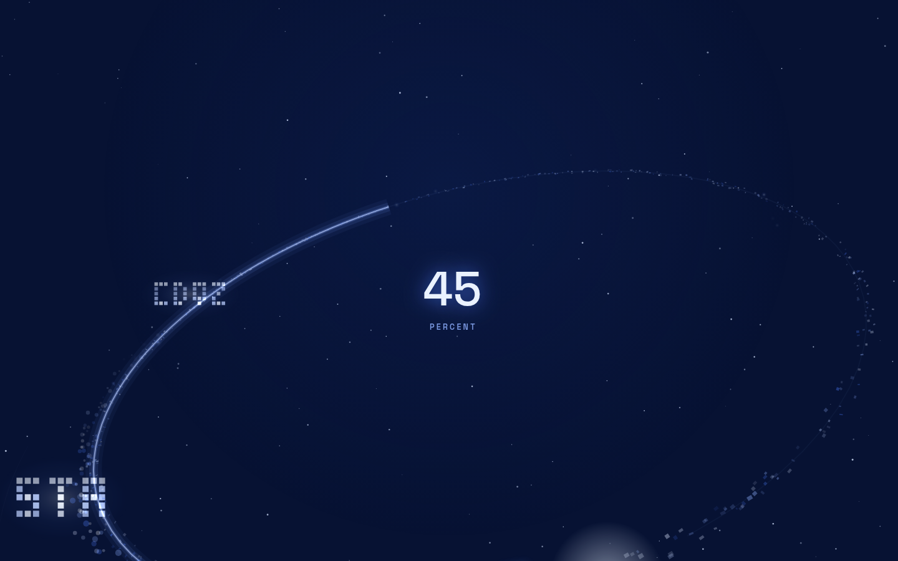
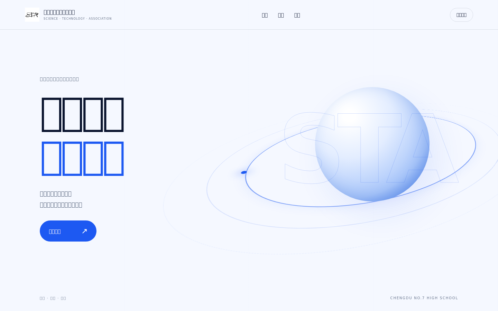
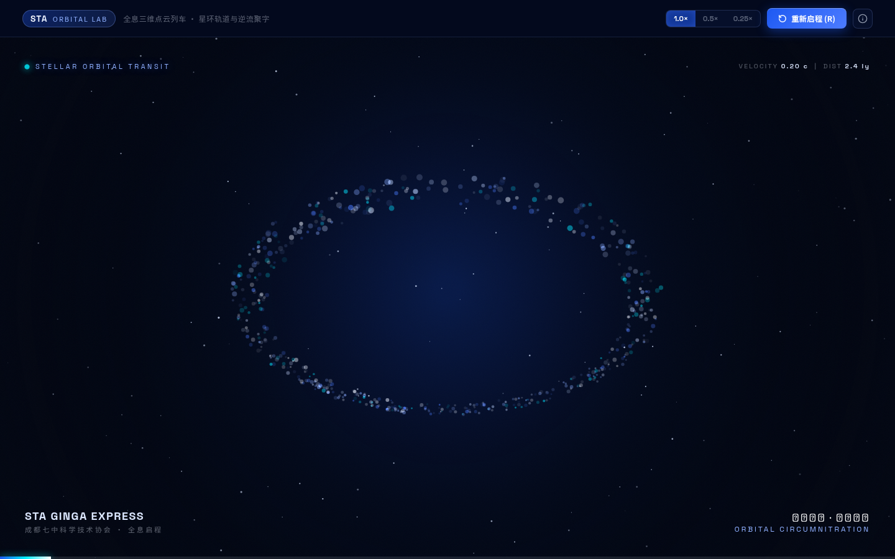

# 成都七中科学技术协会官网 / STA Website

> 成都七中科学技术协会（STA）官方网站。  
> **长空逐月，星河筑梦。**

[在线访问 · www.stacdqz.tech](https://www.stacdqz.tech)



## 项目简介

这是成都七中科学技术协会（Science & Technology Association of Chengdu No.7 High School, STA）的官方网站。

网站用于展示协会介绍、发展历程、组织架构、六大部门、近期活动、成员声音与招新信息，并提供独立公告系统。前台强调科技感、校园组织表达与交互体验；后台则负责内容发布、公告管理、访问统计、审计日志与管理员权限控制。

## 主要功能

- **协会展示**：关于科协、发展历程、组织架构、部门介绍、活动与招新信息；
- **动态首页体验**：Canvas 粒子、滚动动画、横向活动展示、平滑滚动与响应式交互；
- **公告系统**：首页公告板、公告归档、分类 / 搜索 / 分页、公告详情与多图内容；
- **内容后台**：结构化表单编辑 + 所见即所得可视化编辑，修改后即时发布；
- **版本记录与恢复**：网站内容保存历史版本，可回滚最近发布记录；
- **访问分析**：PV / UV、访问趋势、页面来源、设备和地区等统计；
- **审计日志**：记录后台登录、页面访问、内容发布等管理操作；
- **权限管理**：超级管理员 / 普通管理员及内容、日志、公告等细分权限；
- **图片管理**：支持外部图床链接，也可通过 Supabase Storage 上传；
- **移动端适配**：桌面与手机端均提供对应布局和交互。

## 视觉预览

### 首页


### STA Particle



### Stellar Orbital



## 技术栈

| 层级 | 技术 |
| --- | --- |
| 前端 | HTML、CSS、Vanilla JavaScript |
| 动效 | GSAP、ScrollTrigger、Lenis、Canvas |
| 数据库 | Supabase Postgres |
| 服务端能力 | Supabase Edge Functions / RPC |
| 图片 | Supabase Storage + 外部图床 |
| 权限与安全 | RLS、自建管理员会话、细粒度后台权限 |
| 部署 | Vercel |

网站没有引入大型前端框架，主体由原生 HTML / CSS / JavaScript 构成；页面内容可以从 Supabase 读取，并由后台进行可视化或结构化编辑。

## 网站结构

```text
Public Website
├─ 首页 / 协会介绍 / 历程 / 组织架构
├─ 六大部门 / 活动 / 声音 / 招新
├─ 公告板
├─ 公告归档
└─ 公告详情

Admin
├─ 内容管理
│  ├─ 可视化编辑
│  └─ 结构化表单编辑
├─ 公告管理
├─ 访问日志
├─ 审计日志
└─ 管理员与权限

Data / Backend
├─ Supabase Postgres
├─ Row Level Security
├─ RPC / Database Functions
├─ Edge Functions
└─ Storage
```

## 内容管理

后台提供两种互补的编辑方式：

1. **可视化编辑**：直接在真实页面样式中点选文字或图片进行修改，适合日常文案和图片更新；
2. **表单编辑器**：按模块查看和编辑结构化数据，适合增删项目、调整顺序或批量维护。

所有正式修改都通过统一发布流程写入版本历史，发布前可以预览，发布后也可以恢复旧版本。

## 公告系统

公告与主站内容分开存储，支持：

- 草稿、发布、定时发布、撤回与归档；
- 分类筛选、关键词搜索与分页；
- 标题、摘要、封面、正文内容块和多图画廊；
- 首页重点公告；
- 公告版本历史与恢复；
- 发布前字段和链接检查；
- 电脑 / 手机实时预览。

## 安全与数据边界

- 对外页面只开放必要的公开数据；
- 后台管理员与会话使用独立表管理；
- 写操作通过数据库函数校验会话和权限；
- 关键数据表启用 Row Level Security；
- 高权限密钥仅用于服务端环境，不进入公开前端；
- 后台操作写入审计日志；
- 访问日志只对具有对应权限的管理员开放。

## 项目目录

```text
.
├─ index.html
├─ notices.html
├─ notice.html
├─ css/
├─ js/
├─ admin/
├─ image_dev/
├─ design/
├─ docs/
├─ supabase/
├─ SETUP.md
└─ vercel.json
```

详细的数据库、后台、访问日志、Edge Function、Vercel 和首次部署步骤见 [SETUP.md](SETUP.md)。

## 部署

前台使用 Vercel 静态部署，数据与后台能力由 Supabase 提供。

```text
Browser
   │
   ▼
Vercel Static Site
   │
   ├── Public content / notices
   ├── Admin UI
   │
   ▼
Supabase
   ├── Postgres
   ├── RLS / RPC
   ├── Edge Functions
   └── Storage
```

每次推送到主分支后可由 Vercel 自动部署。

## 相关信息

- **官网**：[https://www.stacdqz.tech](https://www.stacdqz.tech)
- **组织**：成都七中科学技术协会 / STA
- **创立时间**：1999
- **核心价值**：自由 · 公平 · 勇气
- **会刊**：《未来梦》

---

**Long live STA.**
